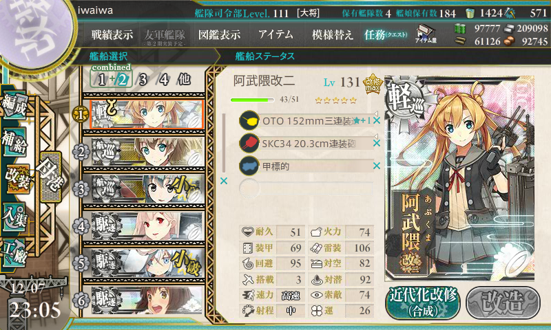
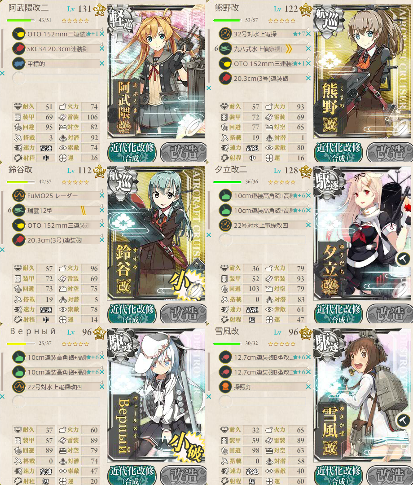

# KankoreScreenshotMerge

艦これの単艦改装画面のスクリーンショットから装備とLv、ステータスが分かるようトリミングして、
部隊全体の編成と装備が分かる画像をマージするバッチファイルです。

## インストール
IrfanView http://www.irfanview.com/ を使います。
ダウンロードして適当なフォルダにインストールしてください。
で、batファイルの3行目にi_view32.exeの実行ファイルをフルパスで記述してください。
64bitでも動くと思いますが、ノーテストです。

## 使い方
改装画面、もしくは編成画面で詳細を押した状態でスクリーンショットをとってください。
私は提督業も忙しい！ http://grabacr.net/kancolleviewer を使わせていただいています。

（阿武隈は改二になって便利すぎる子に育ってしまったので、そこら中で見るようなりましたね。嬉しいような寂しいような）

で、6隻のスクリーンショットが取れたら6つのファイルができあがると思いますので、
それを6つとも選択してbatファイルにD&Dすれば KanColleMerge_HHMMSS.png というファイル名ができあがると思います。

2015秋イベントE-3-Fで朝霜掘り編成（第二艦隊）
疲労抜きの間に作りました。次は55回目、そろそろ心が折れそう（残り12時間ぐらい　まるゆmgmg）

### 注意点
6艦専用です。1-5とか知りません（忘れてた）
連合艦隊？知らない子たちですね・・・
